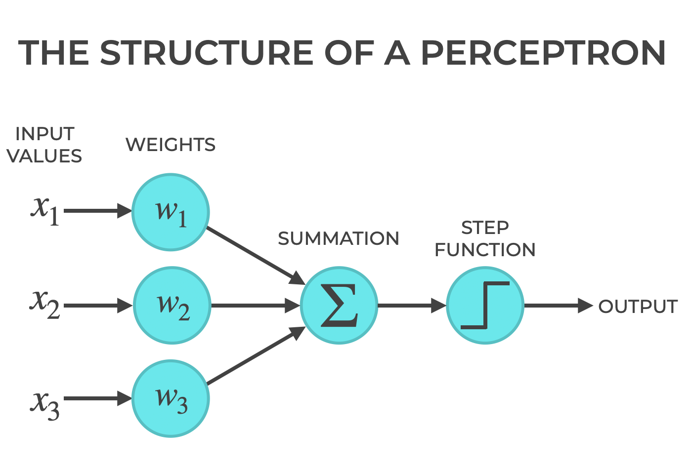
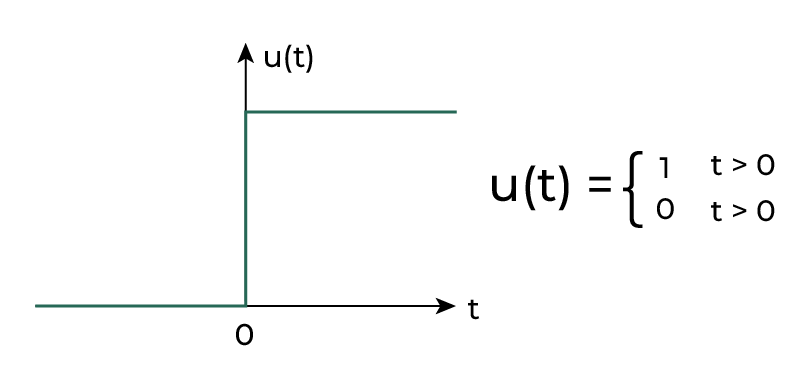
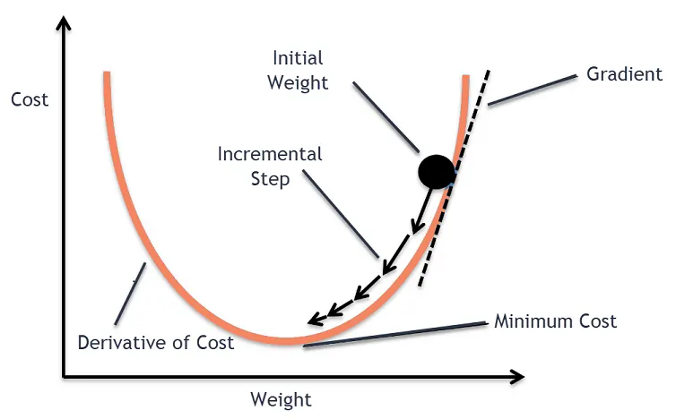

# Backpropagation algorithm library

This library is a simple implementation of the backpropagation algorithm. The library is written in Python and uses the numpy library for matrix operations.

## Backpropagation algorithm
> In machine learning, backpropagation is a gradient estimation method commonly used for training a neural network to compute its parameter updates (source [Wikipedia](https://en.wikipedia.org/wiki/Backpropagation)).

The backpropagation algorithm is particuraly useful in neural networks where it is used to update the weights of the network in order to minimize the error of the network.

### Steps of the backpropagation algorithm in neural networks
The backpropagation algorithm consists of the following steps:
1. Forward pass
2. Compute the error
3. Backward pass
4. Update the weights

### 1. Forward pass
The forward pass is the process of computing the output of the network given an input. The output of the network is computed by propagating the input through the network and applying the activation function to the output of each layer.

Below is a simple example of a neural network that is called "perceptron" with one input layer and one output layer.

Source: [Sharp Sight](https://www.sharpsightlabs.com/blog/python-perceptron-from-scratch/).

The input values here correspond to the values that are fed into the network.
The summation node or neuron is the **dot product** between the input values and the weights of the network, plus a certain value called the *bias*. In other words:

$$
\text{summation} = \sum_{i=1}^{n} x_i \cdot w_i + b
$$

Where $x_i$ is the input value, $w_i$ is the weight of the network and $b$ is the bias.

After that, the summation is passed through an activation function. The activation function is used to introduce non-linearity into the network, it can be a step function, sigmoid function, ReLU function, etc. The one used in the picture above is called the step function:

The output of the network is the output of the activation function.

### 2. Compute the error
The error is computed by comparing the output of the network with the true value. The error is computed using a loss function, for example, the mean squared error:

$$
\text{MSE} = \frac{1}{n} \sum_{i=1}^{n} (y_i - \hat{y}_i)^2
$$

Where $y_i$ is the true value and $\hat{y}_i$ is the predicted value, and $n$ is the number of samples.

### 3. Backward pass
The backward pass is the process of computing the gradient of the loss function with respect to the weights of the network.

Source: [Analytics Vidhya](https://www.analyticsvidhya.com/blog/2020/10/how-does-the-gradient-descent-algorithm-work-in-machine-learning/).
